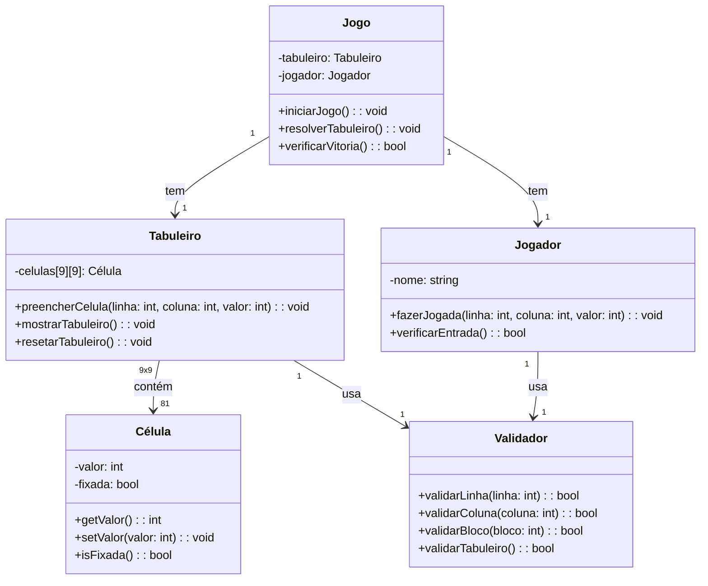

# Projeto Sudoku
## Desenvolvendo para entrega do Desafio de Projeto Bootcamp Bradesco - Java Cloud Native
O Sudoku é um jogo de lógica que consiste em uma grade de 9x9, dividida em 9 subgrupos (ou "caixas") de 3x3. O objetivo do jogo é preencher todos os quadrados da grade com números de 1 a 9, respeitando algumas regras simples:
1.	Cada linha da grade deve conter todos os números de 1 a 9, sem repetição
2.	Cada coluna também deve conter todos os números de 1 a 9, sem repetição
3.	Cada uma das 9 subgrades 3x3 deve conter todos os números de 1 a 9, sem repetição
   
### Como jogar:
•	A grade inicial do Sudoku já começa com alguns números preenchidos. O número de pistas pode variar, mas sempre haverá números suficientes para garantir que a solução seja possível
•	O jogador deve preencher os espaços vazios de maneira que todas as linhas, colunas e subgrupos sigam as regras de não repetição de números

### Estratégias comuns para resolver:
•	Preencher números óbvios: Comece preenchendo os quadrados que são fáceis de deduzir a partir dos números já preenchidos. Às vezes, só um número pode preencher um lugar específico
•	Procura de candidatos: Para cada espaço vazio, olhe os números já presentes na linha, coluna e subgrade, e elimine as opções impossíveis. Isso pode ajudar a encontrar o número correto para aquele espaço
•	Uso de técnicas avançadas: Para Sudoku mais difíceis, técnicas como "caixas de candidatos" ou "tentativas e erros" podem ser úteis, mas as soluções sempre devem seguir as regras lógicas
O Sudoku pode ser encontrado em diversos níveis de dificuldade, desde os mais fáceis até os bem complexos, que exigem mais estratégia e paciência

## Fuxograma básico representando as etapas do jogo:

   ```mermaid
graph TD;
    A[Início] --> B{Verificar se há células preenchidas};
    B -->|Sim| C[Preencher números lógicos];
    B -->|Não| D[Escolher número para preencher];
    C --> E{Verificar regras};
    D --> E;
    E -->|Regras violadas| F[Voltar e tentar outro número];
    E -->|Regras OK| G{Sudoku completo?};
    F --> B;
    G -->|Sim| H[Fim];
    G -->|Não| C;
    H --> I[Parabéns!];

```
## Diagrama de classes



### Explicação das classes:
•	Jogo: Controla o fluxo do jogo, incluindo o tabuleiro e o jogador. Tem métodos como iniciar o jogo, resolver o tabuleiro e verificar a vitória
•	Tabuleiro: Contém o estado do tabuleiro 9x9, que é representado por uma matriz de objetos Célula. Tem métodos para preencher células, mostrar o tabuleiro e resetar o jogo
•	Célula: Representa uma célula individual no tabuleiro. Cada célula tem um valor e um estado fixo, se ela foi dada no início ou se o jogador pode alterar
•	Validador: Faz a validação das regras do Sudoku, verificando se as linhas, colunas e blocos estão corretos
•	Jogador: Representa o jogador. Ele pode fazer uma jogada (preencher uma célula) e verificar se a entrada está correta, o número pode ser colocado na célula sem violar as regras

